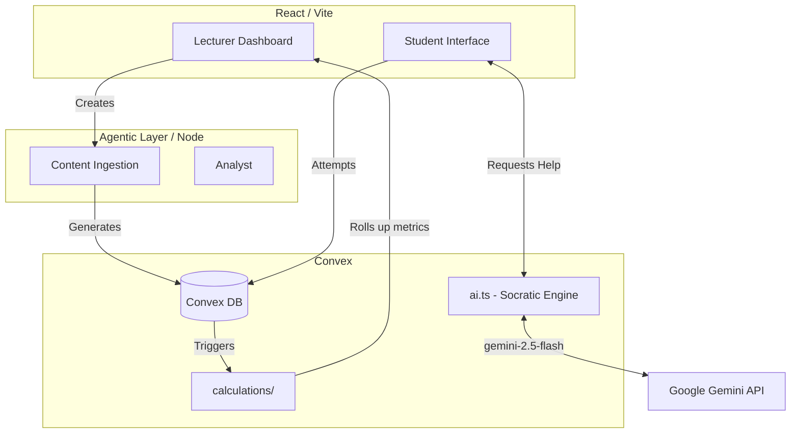

# CogAIt - Pre-Push Project Audit

## 1. Executive Summary
CogAIt is an AI-powered learning platform prototype designed to reduce student AI dependency by providing Socratic, tiered assistance. Based on the code review and build checks, the project is **end-to-end functional** structurally. It compiles cleanly (zero TypeScript errors) and contains real, robust implementations of its core AI features (no mocked logic for the core tutoring loop). However, the biggest risks before pushing are large unignored `.zip` files in the root and a complete lack of automated tests.

## 2. Project Structure
The repository is structured as a modern full-stack monorepo:
- **`/src/`**: The frontend React app (Vite). Implements role-based routing (`/student/*` vs `/lecturer/*`) via React Router.
- **`/convex/`**: The backend. Uses Convex for database schema, auth, and API routes. Contains the core domain logic (e.g., `ai.ts`, `assignments.ts`).
- **`/agents/`**: An independent agentic layer (Node/Hono) managing background tasks (content ingestion, long-term analytics, recommendation negotiations) using Google GenAI and Groq.
- **Root Files**: Standard Node manifests (`package.json`), Vite config, Tailwind config, and several large `.zip` artifacts (`project.zip`, `cogait_backup.zip`).

*Note: There is no dead code apparent at the top level, though some files like `README.md` and `readme1.md` seem duplicative.*

## 3. Dependencies and Setup
**System Requirements:**
- Node.js (v20+ recommended)
- Convex CLI
- External APIs: Google Gemini API, Groq API (for agents), Resend (for emails).

**Manifest Analysis (`package.json` & `agents/package.json`):**
- **Frontend/Backend:** `@convex-dev/auth`, `convex` (v1.31.2), `react` (v19), `react-router-dom`, `sonner`, `@google/generative-ai`.
- **Agents:** `@google/genai`, `groq-sdk`, `hono`, `convex`.
- **Status:** All dependencies resolve correctly. A fresh `npm install` and `npm run typecheck` complete successfully without errors.
- **Missing:** No test framework (e.g., Jest, Vitest) is installed.

## 4. Architecture and Working
CogAIt uses a two-sided platform architecture (Student vs Lecturer) connected by a strict AI agentic layer. 

**Data Flow:**
1. **Teacher Input:** Lecturer uploads a PDF/prompt to create an assignment.
2. **Ingestion (Agent 5):** Parses material and generates structured questions in the Convex DB.
3. **Student Attempt:** Student starts assignment (session locked to prevent tab switching).
4. **Socratic AI Interaction:** When asking for help, `ai.ts` intercepts the request, reads conversation history, calculates `HELP_LEVELS` (1 to 4), and prompts Gemini to *never* give the final answer.
5. **Analytics Rollup:** After completion, cognitive and independence scores are calculated and fed back to the lecturer dashboard.

## 5. Component Status Table

| Component | Status | Evidence | Notes |
| :--- | :--- | :--- | :--- |
| **Build System** | WORKING | `npm run typecheck` and `npm run build` exited with code 0. | 1818 modules transformed successfully. |
| **Convex DB Schema** | WORKING | `convex/schema.ts` is heavily indexed and relational. | Solid implementation of `attempts`, `questions`, and `aiInteractions`. |
| **AI Socratic Tutor** | WORKING | `convex/ai.ts` contains real constraints, fallback generation, and JSON parsing. | It actively manages 4 `HELP_LEVELS` and catches regressions. Not a mock. |
| **Agentic Node Layer** | WORKING | `agents/src/` exists and builds cleanly. | Includes `groq-sdk` and `hono` for modular micro-agents. |
| **Testing** | UNTESTED | `grep` for `*.test.ts` and `*.spec.ts` returned 0 results. | No automated test suite exists. |

## 6. End-to-End Verdict
**Verdict: Functional but Untested.** 
The project is structurally sound and the core engineering work (especially the Socratic constraints in `ai.ts` and the complex Convex schema) is genuinely impressive and fully implemented. However, the chain breaks at **quality assurance**. Without automated tests, complex state transitions (like jumping between Help Level 2 and 3 based on reasoning character counts) are highly susceptible to regressions in production.

## 7. Push-Readiness Checklist
**P0 (Blockers - Fix before push):**
- [ ] **Remove or ignore large zip files:** `project.zip` (29MB), `cogait_backup.zip`, and `cogait-ui-export.zip` are sitting in the root. Add `*.zip` to `.gitignore` or delete them so they don't bloat the Git history.
- [ ] **Sanitize environments:** The local `.env.local` and `agents/.env` contain live Google/Groq API keys and Convex deploy keys. While `.gitignore` correctly ignores these filenames, ensure you don't force-add them. Create `.env.example` files with dummy values for the repo.

**P1 (Should fix soon):**
- [ ] **Add a LICENSE:** Essential for an open-source public repository.
- [ ] **Consolidate READMEs:** There is a `README.md` and a `readme1.md`. Merge them.

**P2 (Polish):**
- [ ] Add a basic Vitest setup to test the AI policy logic.

## 8. Innovation and Differentiation
**Novelty:** The true USP of CogAIt is its **Socratic constraint architecture**. Most wrappers around LLMs (even in EdTech) optimize for answering the student's question efficiently. CogAIt optimizes for *keeping the student thinking*. The rigid enforcement of 4 help levels (Audit, Increased Guidance, Higher Assistance, Maximum Guidance) combined with a requirement for the student to write >100 chars of reasoning before help is given, is a robust, unique pedagogical implementation. 
**Comparison:** While tools like Khanmigo use system prompts to act Socratic, CogAIt enforces it at the infrastructure layer (tracking `independenceScore`, tab-switch locking, and AI regression blocks). It bridges the gap between a standard AI chat UI and an actual cognitive assessment tool.

## 9. Suggested Repo Description and Topics
**Description:** "An agentic AI learning platform designed to reduce student AI-dependency through progressive Socratic tutoring and cognitive analytics."
**Topics:** `react`, `convex`, `ai-tutor`, `edtech`, `gemini-api`, `agentic-ai`, `socratic-learning`

## 10. Open Questions
- **Billing:** Have you set up cost governance limits on the Gemini API? The platform logs tokens, but ensure you have hard caps on your GCP account before going public.
- **Language Support:** The problem statement implies equity and language access, but the codebase primarily assumes English. Is i18n planned for the immediate future?
