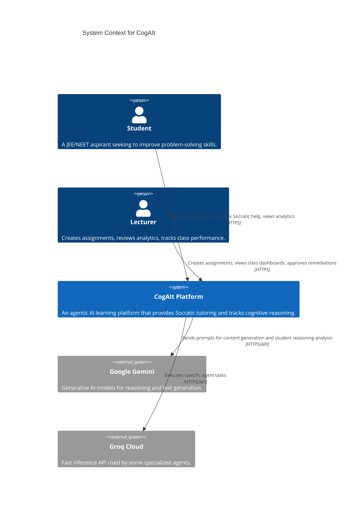

# System Context Diagram

```mermaid
C4Context
    title System Context for CogAIt

    Person(student, "Student", "A JEE/NEET aspirant seeking to improve problem-solving skills.")
    Person(lecturer, "Lecturer", "Creates assignments, reviews analytics, tracks class performance.")
    
    System(cogait, "CogAIt Platform", "An agentic AI learning platform that provides Socratic tutoring and tracks cognitive reasoning.")

    System_Ext(gemini, "Google Gemini", "Generative AI models for reasoning and text generation.")
    System_Ext(groq, "Groq Cloud", "Fast inference API used by some specialized agents.")

    Rel(student, cogait, "Takes assignments, receives Socratic help, views analytics", "HTTPS")
    Rel(lecturer, cogait, "Creates assignments, views class dashboards, approves remediations", "HTTPS")
    Rel(cogait, gemini, "Sends prompts for content generation and student reasoning analysis", "HTTPS/API")
    Rel(cogait, groq, "Executes specific agent tasks", "HTTPS/API")
```
