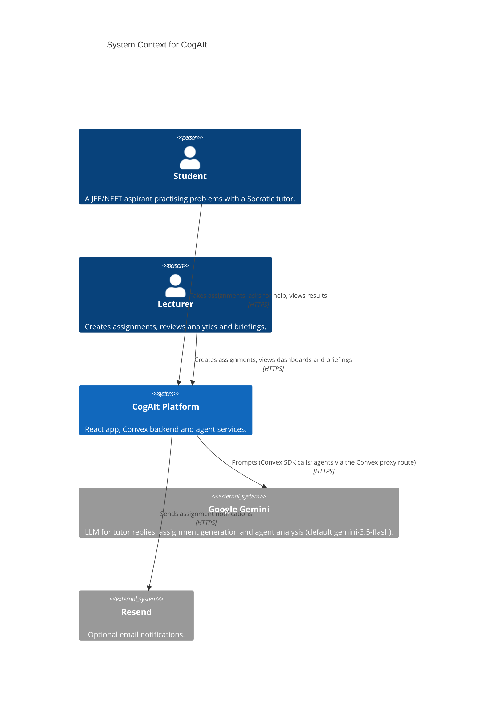

# System Context Diagram

```mermaid
C4Context
    title System Context for CogAIt

    Person(student, "Student", "A JEE/NEET aspirant practising problems with a Socratic tutor.")
    Person(lecturer, "Lecturer", "Creates assignments, reviews analytics and briefings.")

    System(cogait, "CogAIt Platform", "React app, Convex backend and agent services.")

    System_Ext(gemini, "Google Gemini", "LLM for tutor replies, assignment generation and agent analysis (default gemini-3.5-flash).")
    System_Ext(resend, "Resend", "Optional email notifications.")

    Rel(student, cogait, "Takes assignments, asks for help, views results", "HTTPS")
    Rel(lecturer, cogait, "Creates assignments, views dashboards and briefings", "HTTPS")
    Rel(cogait, gemini, "Prompts (Convex SDK calls; agents via the Convex proxy route)", "HTTPS")
    Rel(cogait, resend, "Sends assignment notifications", "HTTPS")
```
