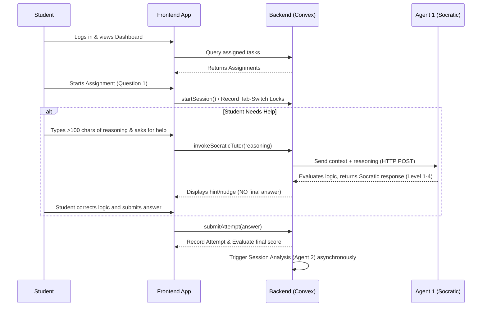

# Main User Flow

```mermaid
sequenceDiagram
    participant S as Student
    participant UI as Frontend App
    participant B as Backend (Convex)
    participant A1 as Agent 1 (Socratic)

    S->>UI: Logs in & views Dashboard
    UI->>B: Query assigned tasks
    B-->>UI: Returns Assignments
    S->>UI: Starts Assignment (Question 1)
    UI->>B: startSession() / Record Tab-Switch Locks
    
    alt Student Needs Help
        S->>UI: Types >100 chars of reasoning & asks for help
        UI->>B: invokeSocraticTutor(reasoning)
        B->>A1: Send context + reasoning (HTTP POST)
        A1-->>B: Evaluates logic, returns Socratic response (Level 1-4)
        B-->>UI: Displays hint/nudge (NO final answer)
        S->>UI: Student corrects logic and submits answer
    end
    
    UI->>B: submitAttempt(answer)
    B-->>UI: Record Attempt & Evaluate final score
    B->>B: Trigger Session Analysis (Agent 2) asynchronously
```
