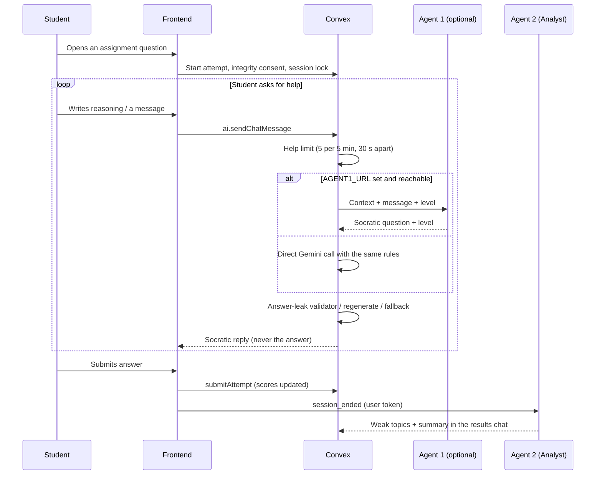

# Main User Flow

```mermaid
sequenceDiagram
    participant S as Student
    participant UI as Frontend
    participant B as Convex
    participant A1 as Agent 1 (optional)
    participant A2 as Agent 2 (Analyst)

    S->>UI: Opens an assignment question
    UI->>B: Start attempt, integrity consent, session lock

    loop Student asks for help
        S->>UI: Writes reasoning / a message
        UI->>B: ai.sendChatMessage
        B->>B: Help limit (5 per 5 min, 30 s apart)
        alt AGENT1_URL set and reachable
            B->>A1: Context + message + level
            A1-->>B: Socratic question + level
        else
            B->>B: Direct Gemini call with the same rules
        end
        B->>B: Answer-leak validator / regenerate / fallback
        B-->>UI: Socratic reply (never the answer)
    end

    S->>UI: Submits answer
    UI->>B: submitAttempt (scores updated)
    UI->>A2: session_ended (user token)
    A2-->>B: Weak topics + summary in the results chat
```
