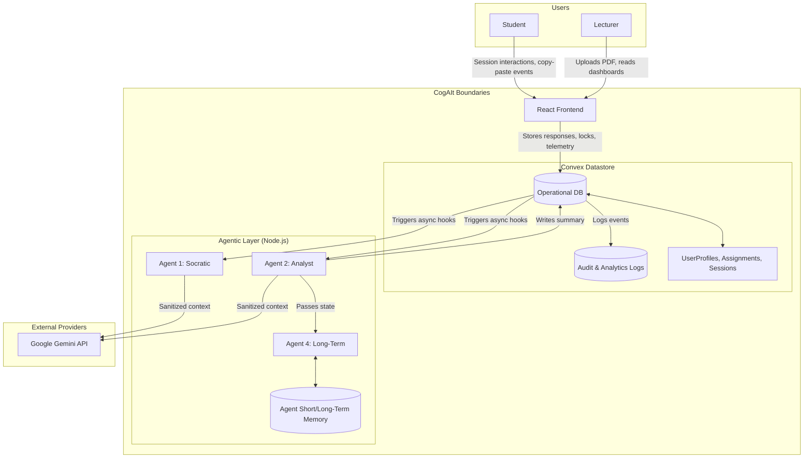

# Data Flow Diagram

```mermaid
flowchart TD
    subgraph Users
        S[Student]
        L[Lecturer]
    end

    subgraph "CogAIt Boundaries"
        UI[React Frontend]
        
        subgraph "Convex Datastore"
            DB[(Operational DB)]
            Logs[(Audit & Analytics Logs)]
            Tables[UserProfiles, Assignments, Sessions]
        end

        subgraph "Agentic Layer (Node.js)"
            A1[Agent 1: Socratic]
            A2[Agent 2: Analyst]
            A4[Agent 4: Long-Term]
            Mem[(Agent Short/Long-Term Memory)]
        end
    end

    subgraph "External Providers"
        LLM[Google Gemini API]
    end

    S -->|Session interactions, copy-paste events| UI
    L -->|Uploads PDF, reads dashboards| UI
    
    UI -->|Stores responses, locks, telemetry| DB
    DB <--> Tables
    DB -->|Logs events| Logs

    DB -->|Triggers async hooks| A1
    DB -->|Triggers async hooks| A2
    A2 -->|Writes summary| DB
    A2 -->|Passes state| A4
    A4 <--> Mem

    A1 -->|Sanitized context| LLM
    A2 -->|Sanitized context| LLM
```
