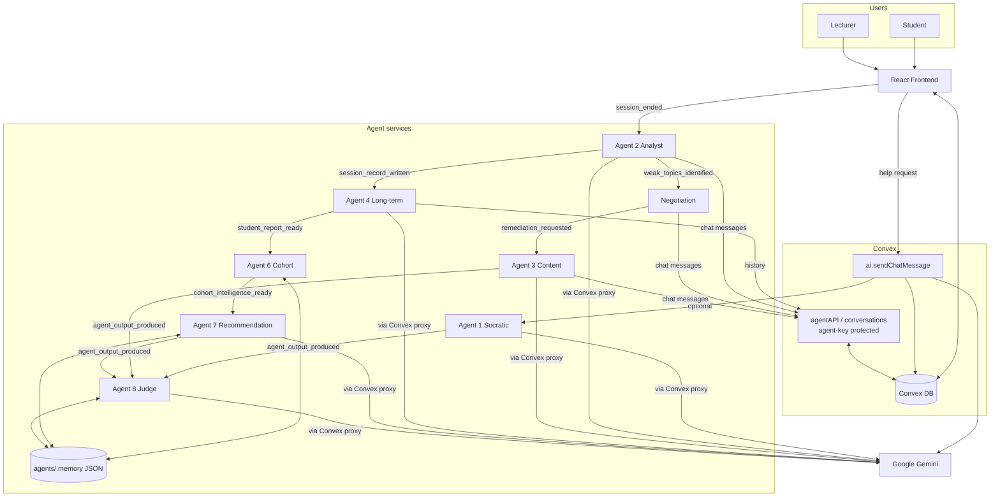

# Data Flow Diagram

```mermaid
flowchart TD
    subgraph Users
        S[Student]
        L[Lecturer]
    end

    UI[React Frontend]
    subgraph Convex
        DB[(Convex DB)]
        Tutor[ai.sendChatMessage]
        API[agentAPI / conversations
agent-key protected]
    end

    subgraph Agents["Agent services"]
        A1[Agent 1 Socratic]
        A2[Agent 2 Analyst]
        N[Negotiation]
        A3[Agent 3 Content]
        A4[Agent 4 Long-term]
        A6[Agent 6 Cohort]
        A7[Agent 7 Recommendation]
        A8[Agent 8 Judge]
        Mem[(agents/.memory JSON)]
    end

    LLM[Google Gemini]

    S --> UI
    L --> UI
    UI <--> DB
    UI -->|help request| Tutor
    Tutor -->|optional| A1
    Tutor --> LLM
    Tutor --> DB

    UI -->|session_ended| A2
    A2 -->|weak_topics_identified| N
    N -->|remediation_requested| A3
    A2 -->|session_record_written| A4
    A4 -->|history| API
    A4 -->|student_report_ready| A6
    A6 -->|cohort_intelligence_ready| A7
    A1 & A3 & A7 -->|agent_output_produced| A8
    A2 & N & A3 -->|chat messages| API
    API <--> DB
    A6 & A7 & A8 <--> Mem
    A1 & A2 & A3 & A4 & A7 & A8 -->|via Convex proxy| LLM
```
