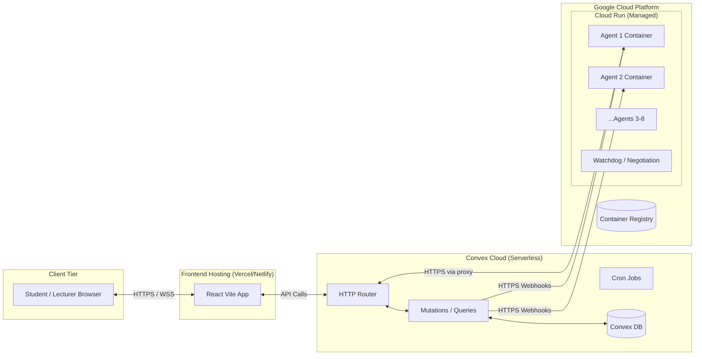

# Deployment Architecture

```mermaid
flowchart LR
    subgraph "Client Tier"
        Browser[Student / Lecturer Browser]
    end

    subgraph "Frontend Hosting (Vercel/Netlify)"
        React[React Vite App]
    end

    subgraph "Convex Cloud (Serverless)"
        Router[HTTP Router]
        Mutations[Mutations / Queries]
        Crons[Cron Jobs]
        Datastore[(Convex DB)]
    end

    subgraph "Google Cloud Platform"
        subgraph "Cloud Run (Managed)"
            CR1[Agent 1 Container]
            CR2[Agent 2 Container]
            CRN[...Agents 3-8]
            Watch[Watchdog / Negotiation]
        end
        GCR[(Container Registry)]
    end

    Browser <-->|HTTPS / WSS| React
    React <-->|API Calls| Router
    Router <--> Mutations
    Mutations <--> Datastore
    
    Mutations -->|HTTPS Webhooks| CR1
    Mutations -->|HTTPS Webhooks| CR2
    
    CR1 -->|HTTPS via proxy| Router
```
