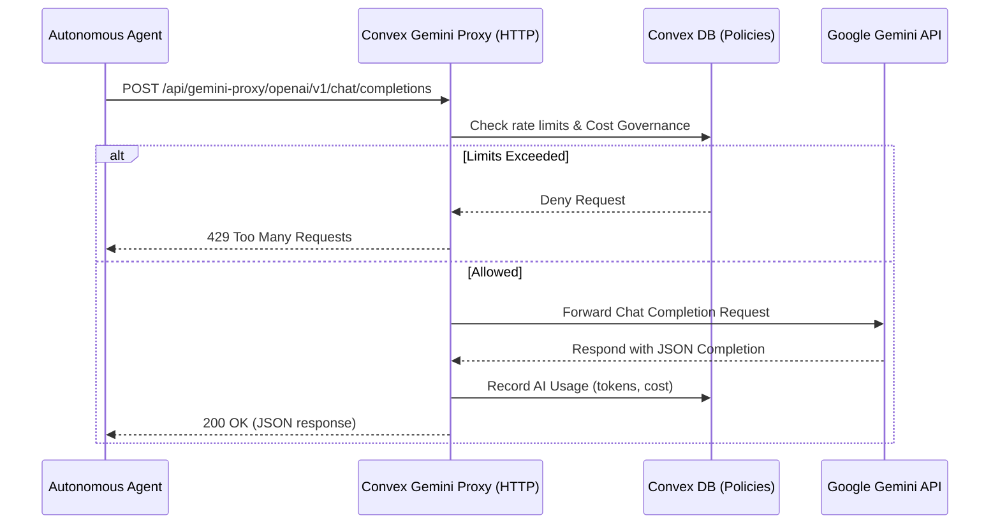

# API Sequence (Gemini Proxy)

```mermaid
sequenceDiagram
    participant A as Autonomous Agent
    participant P as Convex Gemini Proxy (HTTP)
    participant C as Convex DB (Policies)
    participant G as Google Gemini API

    A->>P: POST /api/gemini-proxy/openai/v1/chat/completions
    P->>C: Check rate limits & Cost Governance
    
    alt Limits Exceeded
        C-->>P: Deny Request
        P-->>A: 429 Too Many Requests
    else Allowed
        P->>G: Forward Chat Completion Request
        G-->>P: Respond with JSON Completion
        
        P->>C: Record AI Usage (tokens, cost)
        P-->>A: 200 OK (JSON response)
    end
```
